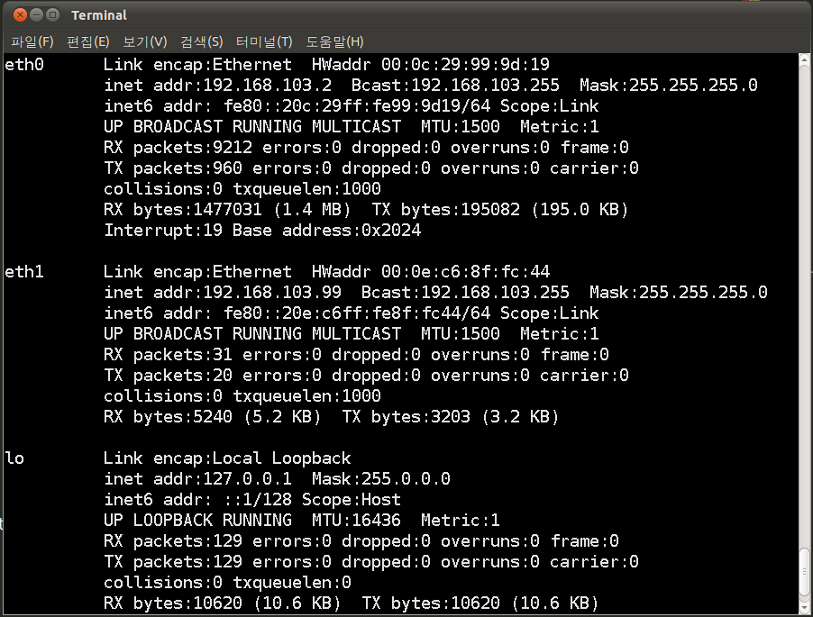
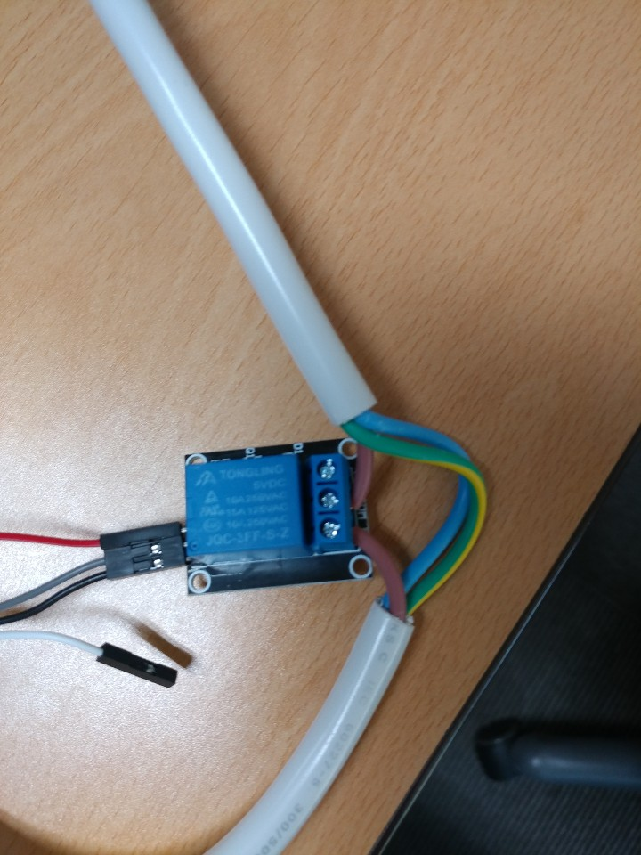

# S3C2450_Final_Project

한컴MDS 임베디드 시스템 소프트웨어 양성과정 최종 프로젝트

## NFS 개발환경 수정

기존에는 PC에서 보드로 이더넷 케이블을 연결하여 직접 IP를 할당하는 방식으로 NFS를 사용하였다.

하지만, 그렇게 되면 네트워크를 사용 할 수 없기 떄문에 소켓 통신을 하지 못한다.

그래서 기존의 IP 할당 하는 방식에서 실제 네트워크에 연결하는 방식으로 변경을 하였다.

### VMware 네트워크 설정 변경

먼저 VMware의 우분투 가상머신의 네트워크 어댑터를 NAT에서 Bridged로 변경한다. (혹은 추가)

변경 후 우분투 가상머신의 네트워크 인터페이스 (Bridged로 연결한 네트워크 어댑터를 사용한다)



### U-Boot 설정 변경

ipaddr == 보드의 IP

serverip == PC의 IP

gatewayip == 보드와 PC에서 연결한 네트워크의 게이트웨이 IP

netmask == 넷 마스크

bootargs의 구성

    root=/dev/nfs rw nfsroot=<serverip>:<파일 시스템 디렉터리> ip=<ipaddr>:192.168.:<gatewayip>:<netmask>::eth0:on console=ttySAC1,115200n81

기존 U-Boot 설정 값

    set ipaddr 192.168.0.3
    set serverip 192.168.0.2
    set gatewayip 192.168.0.1
    setenv bootargs "root=/dev/nfs rw nfsroot=192.168.0.2:/tftpboot/rootfs/rootfs ip=192.168.0.3:192.168.:192.168.0.1:255.255.255.0::eth0:on console=ttySAC1,115200n81"
    saveenv

바꾼 U-Boot 설정 값

    set ipaddr 192.168.103.3
    set serverip 192.168.103.99
    set gatewayip 192.168.103.1
    setenv bootargs "root=/dev/nfs rw nfsroot=192.168.103.99:/tftpboot/rootfs/rootfs ip=192.168.103.3:192.168.:192.168.103.1:255.255.255.0::eth0:on console=ttySAC1,115200n81"
    saveenv

※ 당연하겠지만 보드와 PC를 같은 네트워크 상에 연결하는 것이 중요하다.

### 보드 재 부팅

    tftp 32000000 zImage; bootm 32000000

NFS 설정을 바꾸고 난 뒤에 기존에 파일시스템이 뻗는 일이 잦았는데 이제는 그런 경우가 없어졌다.


## 멀티탭 개조



멀티탭 선의 피복을 벗기고 3개의 선중에 갈색 상전압선의 중앙을 자르고 양쪽의 피복을 벗겨서 

한 쪽은 NO(노말 오픈), 한쪽은 COM(공통 단자)에 연결한다. 선을 연결 할 때 실수를 하게 되면 위험하므로 주의가 필요하다.


## 커널 코드 수정

커널 코드에서 수정해야 할 일은 디바이스 드라이버 수정이다.

그 다음 수정 한 값에 맞게 설정 값들을 수정 해주는 것이 필수이다.

### 디바이스 드라이버 작성

먼저 캐릭터 디바이스 드라이버를 새로 하나 만들고 플랫폼 디바이스 드라이버에서 해당 디바이스 드라이버를 추가해준다.

[캐릭터 디바이스 드라이버 디렉토리](https://github.com/SdKfz171/S3C2450_Final_Project/tree/master/Kernel/drivers/char)

[머신 코드 디렉토리](https://github.com/SdKfz171/S3C2450_Final_Project/tree/master/Kernel/arch/arm/mach-s3c2416)

#### 캐릭터 디바이스 드라이버 작성

module_init(), module_exit()

모듈의 코드는 위의 부분에서 시작하고 끝난다.

그러므로 위의 로직을 먼저 구현 해주어야 한다. 인자는 함수 포인터이다.

```c
// 모듈 초기화 코드 
static int __init mds2450_multitab_control_init(void)
{
 	return platform_driver_register(&mds2450_multitab_control_device_driver);
}

// 모듈 해제 코드
static void __exit mds2450_multitab_control_exit(void)
{
	platform_driver_unregister(&mds2450_multitab_control_device_driver);
}
```

그 다음에 이 캐릭터 디바이스 드라이버를 플랫폼 디바이스 드라이버로 활용 할 것이기 떄문에 해당 구조체를 만들어준다.
```c
// 플랫폼 디바이스 드라이버 관련 구조체
static struct platform_driver mds2450_multitab_control_device_driver = {
	.probe      = mds2450_multitab_control_probe,
	.remove     = __devexit_p(mds2450_multitab_control_remove),
	.driver     = {
		.name   = "mds2450-multitab_control",
		.owner  = THIS_MODULE,
	}
};
```

플랫폼 디바이스 드라이버에서는 init과 exit과 같은 역할을 probe와 remove가 한다.

probe에서는 캐릭터 디바이스 드라이버를 등록하고 remove에서는 해제해주는 코드를 작성한다.

```c
// 캐릭터 디바이스 드라이버 관련 초기화 함수
static int __devinit mds2450_multitab_control_probe(struct platform_device *pdev)
{
	int ret;

	ret = register_chrdev( MDS2450_MULTITAB_CONTROL_MAJOR, multitab_control_name, &mds2450_multitab_control_fops );

    return ret;
}

static int __devexit mds2450_multitab_control_remove(struct platform_device *pdev)
{
	unregister_chrdev( MDS2450_MULTITAB_CONTROL_MAJOR, multitab_control_name );

	return 0;
}
```

여기서 중요한 것은 register_chrdev함수의 인자인 메이져 넘버와 파일 오퍼레이션 구조체이다.

모든 디바이스 드라이버 파일에는 메이저 넘버와 마이너 넘버가 존재한다.

```c
#define MDS2450_MULTITAB_CONTROL_MAJOR 71
```

메이저 넘버는 제어하려는 디바이스를 구분하기위한 ID이다. 당연하겠지만 각각의 디바이스 드라이버마다 메이저 넘버가 달라야 한다.

마이너 넘버는 해당 디바이스 내부에서 더 상세한 실제 디바이스를 구분 하기 위한 ID이다. 예를 들면 시리얼에서 USART0과 USART1을 구분 하는 것과 같다.  

```c
// 현재 디바이스 드라이버의 파일 오퍼레이션 구조체
static struct file_operations mds2450_multitab_control_fops = {
	.owner 	= THIS_MODULE,
	.open 	= mds2450_multitab_control_open,
	.release= mds2450_multitab_control_release,
	.write 	= mds2450_multitab_control_write,
	.read 	= mds2450_multitab_control_read,
};
```

다음으로 파일 오퍼레이션 구조체은 간단하게 우리가 파일 디스크립터를 열 때 사용하는 open, close, write, read 등의 함수들을 

내 입맛에 맞게 정의하여 사용할 수 있게 해주는 구조체이다. 

open과 같이 사용 할 때 사용자가 정의한 open함수에 연결하기 위해서 사용자 정의 함수의 함수 포인터를 이용한다.

```c
// 파일 오퍼레이션 write 함수
static ssize_t mds2450_multitab_control_write(struct file * filp, const char * buf, size_t count, loff_t * pos){
    char * data;										// 유저에게서 받은 값을 저장 할 버퍼
    data = kmalloc(count, GFP_KERNEL);					// 버퍼에 동적 할당 

    copy_from_user(data, buf, count);					// 유저로 부터 값 복사
    printk("%s\n", data);
    
	multitab_array[data[0] - '0'] = data[1] - '0';		// RELAY 상태 배열에 유저로 받은 값 반영

    kfree(data);										// 버퍼 메모리 해제
    return count;
}

// 파일 오퍼레이션 read 함수
static ssize_t mds2450_multitab_control_read(struct file *filp, char *buff, size_t count, loff_t *offp)
{
	int  ret;
	
	// user로 값을 값을 전송
	copy_to_user((void *)buff, (const void *)&key_value , sizeof(int));
	ret = key_value;
	key_value = 0;
	
	return ret;
}

// 파일 오퍼레이션 open 함수
static int mds2450_multitab_control_open(struct inode * inode, struct file * file)
{
	int ret = 0;
	int i;

	printk(KERN_INFO "ready to scan key value\n");

	// RELAY 상태 배열 동적 할당
	multitab_array = kmalloc(multitab_count, GFP_KERNEL);
	multitab_array_old = kmalloc(multitab_count, GFP_KERNEL);

	// 실행과 함께 상태 초기화
	for(i = 0; i < multitab_count; i++){
		multitab_array[i] = 0;	
		multitab_array_old[i] = multitab_array[i];
	}

	// GPIO Initial
	s3c_gpio_cfgpin(S3C2410_GPG(1), S3C_GPIO_SFN(1));	// EINT9,	RELAY1
	s3c_gpio_cfgpin(S3C2410_GPG(2), S3C_GPIO_SFN(1));	// EINT10,	RELAY2
	s3c_gpio_cfgpin(S3C2410_GPG(3), S3C_GPIO_SFN(1));	// EINT11,	RELAY3
	s3c_gpio_cfgpin(S3C2410_GPG(4), S3C_GPIO_SFN(1));	// EINT12,	LED1
	s3c_gpio_cfgpin(S3C2410_GPG(5), S3C_GPIO_SFN(1));	// EINT13,	LED2
	s3c_gpio_cfgpin(S3C2410_GPG(6), S3C_GPIO_SFN(1));	// EINT14,	LED3
	s3c_gpio_cfgpin(S3C2410_GPG(7), S3C_GPIO_SFN(1));	// EINT15,	LED4

	// Scan timer
	mod_timer(&multitab_control_timer, jiffies + (MULTITAB_CONTROL_TIME));

	return ret;
}

// 파일 오퍼레이션 release 함수
static void mds2450_multitab_control_release(struct inode * inode, struct file * file)
{
	printk(KERN_INFO "end of the scanning\n");

	// 동적 할당한 배열 메모리 해제 
	kfree(multitab_array);								
	kfree(multitab_array_old);							

	del_timer_sync(&multitab_control_timer);			// 타이머 핸들러 해제
}
```
디바이스 드라이버 파일을 open 할 때에는 각종 초기화를 하고 release 할 때에는 할당받은 것들의 해제를 한다.

write를 할 때에는 user의 커널로 복사하고 read를 할 때에는 커널의 값을 user로 복사한다.

##### 상세기능
- open 함수에서는 GPIO 핀을 설정하고 타이머를 세팅 함과 동시에 현재 RELAY(멀티탭)의 상태를 저장 할 배열을 동적할당 했다.

- release 함수에서는 동적할당 한 배열과 타이머를 해제하였다. 동적 할당한 메모리를 해제하지 않으면 메모리 충돌이 일어 날 수 있다.

- write 함수에서는 user로 부터 받은 커맨드를 복사하여 값에 따라 RELAY(멀티탭) 상태 배열의 값을 바꿔준다.

- read 함수를 만들어두긴 했으나 사용을 하지는 않았다. 


다음으로는 타이머 인터럽트 핸들러이다.

```c
// 타이머 핸들러 함수
static void multitab_control_timer_handler(unsigned long data)
{
	int lp;
	int i;

	// RELAY 갯수만큼 반복하며 값 확인
	for(i = 0; i < multitab_count; i++){
		gpio_set_value(S3C2410_GPG(1 + i), multitab_array[i]);		// RELAY 
		gpio_set_value(S3C2410_GPG(4 + i), !multitab_array[i]);		// BOARD LED

		// RELAY의 상태가 이전 값이랑 다르면서
		if(multitab_array_old[i] != multitab_array[i]){
			if(multitab_array[i]) printk("Multitab %d ON\n", i);	// 1이면
			else printk("Multitab %d OFF\n", i);					// 0이면
		}

		multitab_array_old[i] = multitab_array[i];
	}

	mod_timer(&multitab_control_timer, jiffies + (MULTITAB_CONTROL_TIME));
}
```

타이머 인터럽트 핸들러에서 지속적으로 RELAY(멀티탭) 상태 배열의 값을 확인하면서 RELAY의 값에 반영한다.

#### 캐릭터 디바이스 드라이버 소스코드 전체

```c
/*
*	G2450_ADC.C - The s3c2450 adc module.
*/
#include <linux/module.h>
#include <linux/kernel.h>
#include <linux/init.h>
#include <linux/vmalloc.h>
#include <asm/delay.h>
#include <linux/io.h>
#include <plat/adc.h>
#include <plat/devs.h>
#include <linux/platform_device.h>
#include <mach/regs-gpio.h>
#include <linux/gpio.h>
#include <asm/uaccess.h>
#include <linux/fcntl.h>
#include <linux/fs.h>
#include <linux/workqueue.h>
#include <linux/interrupt.h>
#include <linux/sched.h>

#include <linux/slab.h>
#include <linux/timer.h>
#include <linux/interrupt.h>
#include <linux/device.h>
#include <asm/io.h>
#include <asm/irq.h>
#include <plat/gpio-cfg.h>
#include <linux/major.h>
#include <linux/fs.h>
#include <linux/cdev.h>

static void multitab_control_timer_handler(unsigned long data); 

#define MDS2450_MULTITAB_CONTROL_MAJOR 71
static char multitab_control_name[] = "mds2450-multitab_control";

static DECLARE_WAIT_QUEUE_HEAD(multitab_control_wq);

#define MULTITAB_CONTROL_TIME	(1*HZ)
static struct timer_list multitab_control_timer = TIMER_INITIALIZER(multitab_control_timer_handler, 0, 0);

static int key_value = 0;

static char * multitab_array;							// RELAY의 상태를 저장 할 배열
static char * multitab_array_old;						// RELAY의 이전 상태를 저장 할 배열
static int multitab_count = 2;							// RELAY 갯수

// 타이머 핸들러 함수
static void multitab_control_timer_handler(unsigned long data)
{
	int lp;
	int i;

	// RELAY 갯수만큼 반복하며 값 확인
	for(i = 0; i < multitab_count; i++){
		gpio_set_value(S3C2410_GPG(1 + i), multitab_array[i]);		// RELAY 
		gpio_set_value(S3C2410_GPG(4 + i), !multitab_array[i]);		// BOARD LED

		// RELAY의 상태가 이전 값이랑 다르면서
		if(multitab_array_old[i] != multitab_array[i]){
			if(multitab_array[i]) printk("Multitab %d ON\n", i);	// 1이면
			else printk("Multitab %d OFF\n", i);					// 0이면
		}

		multitab_array_old[i] = multitab_array[i];
	}

	mod_timer(&multitab_control_timer, jiffies + (MULTITAB_CONTROL_TIME));
}

// 파일 오퍼레이션 write 함수
static ssize_t mds2450_multitab_control_write(struct file * filp, const char * buf, size_t count, loff_t * pos){
    char * data;										// 유저에게서 받은 값을 저장 할 버퍼
    data = kmalloc(count, GFP_KERNEL);					// 버퍼에 동적 할당 

    copy_from_user(data, buf, count);					// 유저로 부터 값 복사
    printk("%s\n", data);
    
	multitab_array[data[0] - '0'] = data[1] - '0';		// RELAY 상태 배열에 유저로 받은 값 반영

    kfree(data);										// 버퍼 메모리 해제
    return count;
}

// 파일 오퍼레이션 read 함수
static ssize_t mds2450_multitab_control_read(struct file *filp, char *buff, size_t count, loff_t *offp)
{
	int  ret;
	
	// user로 값을 값을 전송
	copy_to_user((void *)buff, (const void *)&key_value , sizeof(int));
	ret = key_value;
	key_value = 0;
	
	return ret;
}

// 파일 오퍼레이션 open 함수
static int mds2450_multitab_control_open(struct inode * inode, struct file * file)
{
	int ret = 0;
	int i;

	printk(KERN_INFO "ready to scan key value\n");

	// RELAY 상태 배열 동적 할당
	multitab_array = kmalloc(multitab_count, GFP_KERNEL);
	multitab_array_old = kmalloc(multitab_count, GFP_KERNEL);

	// 실행과 함께 상태 초기화
	for(i = 0; i < multitab_count; i++){
		multitab_array[i] = 0;	
		multitab_array_old[i] = multitab_array[i];
	}

	// GPIO Initial
	s3c_gpio_cfgpin(S3C2410_GPG(1), S3C_GPIO_SFN(1));	// EINT9,	RELAY1
	s3c_gpio_cfgpin(S3C2410_GPG(2), S3C_GPIO_SFN(1));	// EINT10,	RELAY2
	s3c_gpio_cfgpin(S3C2410_GPG(3), S3C_GPIO_SFN(1));	// EINT11,	RELAY3
	s3c_gpio_cfgpin(S3C2410_GPG(4), S3C_GPIO_SFN(1));	// EINT12,	LED1
	s3c_gpio_cfgpin(S3C2410_GPG(5), S3C_GPIO_SFN(1));	// EINT13,	LED2
	s3c_gpio_cfgpin(S3C2410_GPG(6), S3C_GPIO_SFN(1));	// EINT14,	LED3
	s3c_gpio_cfgpin(S3C2410_GPG(7), S3C_GPIO_SFN(1));	// EINT15,	LED4

	// Scan timer
	mod_timer(&multitab_control_timer, jiffies + (MULTITAB_CONTROL_TIME));

	return ret;
}

// 파일 오퍼레이션 release 함수
static void mds2450_multitab_control_release(struct inode * inode, struct file * file)
{
	printk(KERN_INFO "end of the scanning\n");

	// 동적 할당한 배열 메모리 해제 
	kfree(multitab_array);								
	kfree(multitab_array_old);							

	del_timer_sync(&multitab_control_timer);			// 타이머 핸들러 해제
}

// 현재 디바이스 드라이버의 파일 오퍼레이션 구조체
static struct file_operations mds2450_multitab_control_fops = {
	.owner 	= THIS_MODULE,
	.open 	= mds2450_multitab_control_open,
	.release= mds2450_multitab_control_release,
	.write 	= mds2450_multitab_control_write,
	.read 	= mds2450_multitab_control_read,
};

// 캐릭터 디바이스 드라이버 관련 초기화 함수
static int __devinit mds2450_multitab_control_probe(struct platform_device *pdev)
{
	int ret;

	ret = register_chrdev( MDS2450_MULTITAB_CONTROL_MAJOR, multitab_control_name, &mds2450_multitab_control_fops );

    return ret;
}

static int __devexit mds2450_multitab_control_remove(struct platform_device *pdev)
{
	unregister_chrdev( MDS2450_MULTITAB_CONTROL_MAJOR, multitab_control_name );

	return 0;
}

// 플랫폼 디바이스 드라이버 관련 구조체
static struct platform_driver mds2450_multitab_control_device_driver = {
	.probe      = mds2450_multitab_control_probe,
	.remove     = __devexit_p(mds2450_multitab_control_remove),
	.driver     = {
		.name   = "mds2450-multitab_control",
		.owner  = THIS_MODULE,
	}
};

// 모듈 초기화 코드 
static int __init mds2450_multitab_control_init(void)
{
 	return platform_driver_register(&mds2450_multitab_control_device_driver);
}

// 모듈 해제 코드
static void __exit mds2450_multitab_control_exit(void)
{
	platform_driver_unregister(&mds2450_multitab_control_device_driver);
}

// 모듈의 시작
module_init(mds2450_multitab_control_init);
module_exit(mds2450_multitab_control_exit);

MODULE_LICENSE("GPL");
MODULE_DESCRIPTION("led multitab_control for MDS2450");
```


#### 플랫폼 디바이스 드라이버(머신 코드) 수정

위에서 만든 디바이스 드라이버를 플랫폼 디바이스 드라이버로 사용하려면 사용하는 보드의 머신코드를 수정을 해야한다.

머신 코드는 하드웨어에 종속적인 코드이다. 각각의 칩마다 다르게 작성되어있다. 

```c
static struct platform_device mds2450_device_multitab_control = {
    .name = "mds2450-multitab_control"
};
```

먼저 플랫폼 드라이버 구조체를 하나 원하는 이름으로 만들어 준다.

```c
static struct platform_device *mds2450_devices[] __initdata = {
    &s3c_device_adc,
    &s3c_device_fb,
    &s3c_device_rtc,
    &s3c_device_wdt,
    &s3c_device_ohci,
    &s3c_device_nand,
    &s3c_device_i2c0,
    &s3c_device_ts,
    &s3c_device_hsmmc0,
    &s3c_device_hsmmc1,
    &s3c_device_usb_hsudc,
    &s3c_device_timer[0], // Gemini 2014.01.15
    &s3c_device_timer[1], // Gemini 2014.01.15
    &mds24_hsudc_vbus_dev,
    &s3c2416_device_iis,
    &samsung_asoc_dma,
    &mds2450_smsc911x,
    &mds2450_device_kscan,
    &mds2450_device_blinky,
    &mds2450_device_multitab_control,	// 추가한 부분
    &mds2450_lcd_innolux43,
};
```

그 다음 플랫폼 디바이스 구조체 배열에 위에서 만든 구조체의 주소를 넣어준다.

머신 코드는 매우 길기 때문에 생략한다.

<br>
이렇게 하면 소스 코드에서 수정해야할 것은 전부 완료 했고 이제 Makefile과 각종 config 파일을 수정 해야한다.


### 각종 설정 파일 수정

캐릭터 디바이스 드라이버 디렉토리에 있는 KConfig 파일을 열어서 menu 밑에 아래의 구문을 추가한다. 

```
config MDS2450_MULTITAB_CONTROL
	tristate "MDS2450_MULTITAB_CONTROL"
	depends on MACH_MDS2450
	default y
	help
	 MDS 2450 MULTITAB_CONTROL
```

또한 Makefile에서도 한 줄을 추가 해준다.

```makefile
obj-y				+= mem.o random.o
obj-$(CONFIG_TTY_PRINTK)	+= ttyprintk.o
obj-y				+= misc.o
obj-$(CONFIG_ATARI_DSP56K)	+= dsp56k.o
obj-$(CONFIG_MDS2450_LED)	+= hello.o
obj-$(CONFIG_MDS2450_HELLO)	+= hello2.o
obj-$(CONFIG_MDS2450_KSCAN)	+= mds2450_keyscan.o
obj-$(CONFIG_MDS2450_BLINKY)	+= mds2450_blinky.o
obj-$(CONFIG_MDS2450_TIMER)	+= timerTest_mod.o
obj-$(CONFIG_MDS2450_MULTITAB_CONTROL)	+= mds2450_multitab_control.o
obj-$(CONFIG_VIRTIO_CONSOLE)	+= virtio_console.o
obj-$(CONFIG_RAW_DRIVER)	+= raw.o
obj-$(CONFIG_SGI_SNSC)		+= snsc.o snsc_event.o
obj-$(CONFIG_MSM_SMD_PKT)	+= msm_smd_pkt.o
obj-$(CONFIG_MSPEC)		+= mspec.o
obj-$(CONFIG_MMTIMER)		+= mmtimer.o
obj-$(CONFIG_UV_MMTIMER)	+= uv_mmtimer.o
obj-$(CONFIG_VIOTAPE)		+= viotape.o
obj-$(CONFIG_IBM_BSR)		+= bsr.o
obj-$(CONFIG_SGI_MBCS)		+= mbcs.o
obj-$(CONFIG_BRIQ_PANEL)	+= briq_panel.o
obj-$(CONFIG_BFIN_OTP)		+= bfin-otp.o

.....

```

당연하겠지만 여기서 추가하는 오브젝트 파일은 캐릭터 디바이스 드라이버의 오브젝트 파일이다.

위와 같이 추가하면 커널 루트 디렉토리에서 make menuconfig를 했을 때 위의 정보대로 캐릭터 디바이스 드라이버에 등록 된 것을 확인 할 수 있다. 


## 리눅스 C 애플리케이션 작성

커널쪽의 디바이스 드라이버를 모두 작성하면 실제로 유저가 실행시킬 애플리케이션 프로그램을 작성한다.

애플리케이션의 구성은 PC에서 실행 시킬 소켓 서버 프로그램과 클라이언트가 되어줄 보드 프로그램이 있다.

### 소켓 서버 프로그램

소켓 서버 프로그램에서는 클라이언트를 accept 해주고 클라이언트로 부터 받은 값을 다시 모든 클라이인트들에게 뿌리는 역할을 수행한다.

#### 소켓 서버 프로그램 소스코드 전체

```c
#include <stdio.h>
#include <stdlib.h>
#include <string.h>
#include <strings.h>
#include <fcntl.h>
#include <sys/socket.h>
#include <sys/file.h>
#include <netinet/in.h>
#include <arpa/inet.h>
#include <unistd.h>
#include <time.h>
#include <pthread.h>

#define TCP_PORT 5555											// 통신 포트
#define MAXLINE  511
#define MAX_SOCK 1024 											// 솔라리스의 경우 64

char *EXIT_STRING = "exit";										// 클라이언트의 종료요청 문자열
char *START_STRING = "Connected to chat_server \n";				// 클라이언트 환영 메시지

int maxfdp1;													// 최대 소켓번호 +1
int num_user = 0;												// 채팅 참가자 수
int num_chat = 0;												// 지금까지 오간 대화의 수
int clisock_list[MAX_SOCK];										// 채팅에 참가자 소켓번호 목록
char ip_list[MAX_SOCK][20];										// 접속한 ip목록
int listen_sock;												// 서버의 리슨 소켓

void addClient(int s, struct sockaddr_in *newcliaddr);			// 새로운 채팅 참가자 처리
int getmax();													// 최대 소켓 번호 찾기
void removeClient(int s);										// 채팅 탈퇴 처리 함수
int tcp_listen(int host, int port, int backlog); 				// 소켓 생성 및 listen
void errquit(char *mesg) { perror(mesg); exit(1); }

time_t ct;
struct tm tm;

void *thread_function(void *arg) { 								// 명령어를 처리할 스레드
	int i;
	printf("명령어 목록 : help, num_user, num_chat, ip_list\n");
	while (1) {
		char bufmsg[MAXLINE + 1];
		fprintf(stderr, "\033[1;32m"); 							// 글자색을 녹색으로 변경
		printf("server>"); 										// 커서 출력
		fgets(bufmsg, MAXLINE, stdin); 							// 명령어 입력
		if (!strcmp(bufmsg, "\n")) continue;   					// 엔터 무시
		else if (!strcmp(bufmsg, "help\n"))    					// help 명령어 처리
			printf("help, num_user, num_chat, ip_list\n");
		else if (!strcmp(bufmsg, "num_user\n"))					// num_user 명령어 처리
			printf("현재 참가자 수 = %d\n", num_user);
		else if (!strcmp(bufmsg, "num_chat\n"))					// num_chat 명령어 처리
			printf("지금까지 오간 대화의 수 = %d\n", num_chat);
		else if (!strcmp(bufmsg, "ip_list\n")) 					// ip_list 명령어 처리
			for (i = 0; i < num_user; i++)
				printf("%s\n", ip_list[i]);
		else
			printf("해당 명령어가 없습니다.help를 참조하세요.\n");
	}
}

int main(int argc, char *argv[]) {
	struct sockaddr_in cliaddr;
	char buf[MAXLINE + 1]; 										// 클라이언트에서 받은 메시지
	int i, j, nbyte, accp_sock, addrlen = sizeof(struct
		sockaddr_in);
	fd_set read_fds;											// 파일 디스크립터 집합
	pthread_t a_thread;											// 쓰레드

	listen_sock = tcp_listen(INADDR_ANY, TCP_PORT, 5);			// tcp_listen(host, port, backlog) 함수 호출
	pthread_create(&a_thread, NULL, thread_function, (void *)NULL);

	while (1) {
		FD_ZERO(&read_fds);										// read_fds를 초기화
		FD_SET(listen_sock, &read_fds);							// read_fds에 소켓(수신 소켓) 디스크립터 값을 추가
		for (i = 0; i < num_user; i++)					
			FD_SET(clisock_list[i], &read_fds);					// read_fds에 소켓(클라이언트 소켓) 디스크립터 값을 추가

		maxfdp1 = getmax() + 1;									// maxfdp1 재 계산

		if (select(maxfdp1, &read_fds, NULL, NULL, NULL) < 0)	// 사용 가능한 파일 디스크립터 조회 
			errquit("select fail");

		if (FD_ISSET(listen_sock, &read_fds)) {					// 수신 소켓이 추가되어 있는지 확인
			accp_sock = accept(listen_sock,
				(struct sockaddr*)&cliaddr, &addrlen);			// 클라이언트 주소 등록
			if (accp_sock == -1) errquit("accept fail");
			addClient(accp_sock, &cliaddr);						// 채팅 참가자 추가 함수 호출
			send(accp_sock, START_STRING, strlen(START_STRING), 0);
			ct = time(NULL);									// 현재 시간을 받아옴
			tm = *localtime(&ct);
			write(1, "\033[0G", 4);								// 커서의 X좌표를 0으로 이동
			printf("[%02d:%02d:%02d]", tm.tm_hour, tm.tm_min, tm.tm_sec);
			fprintf(stderr, "\033[33m");						// 글자색을 노란색으로 변경
			printf("사용자 1명 추가. 현재 참가자 수 = %d\n", num_user);
			fprintf(stderr, "\033[32m");						// 글자색을 녹색으로 변경
			fprintf(stderr, "server>"); 						// 커서 출력
		}

		// 클라이언트가 보낸 메시지를 모든 클라이언트에게 방송
		for (i = 0; i < num_user; i++) {
			if (FD_ISSET(clisock_list[i], &read_fds)) {			// 클라이언트 소켓이 추가되어 있는지 학인
				num_chat++;										// 총 대화 수 증가
				nbyte = recv(clisock_list[i], buf, MAXLINE, 0);	// 클라이언트에서 수신 
				if (nbyte <= 0) {
					removeClient(i);							// 클라이언트의 종료
					continue;
				}
				buf[nbyte] = 0;
				
				if (strstr(buf, EXIT_STRING) != NULL) {			// 종료문자 처리
					removeClient(i);							// 클라이언트의 종료
					continue;
				}
				
				for (j = 0; j < num_user; j++)
					send(clisock_list[j], buf, nbyte, 0);		// 모든 채팅 참가자에게 메시지 방송
				printf("\033[0G");								// 커서의 X좌표를 0으로 이동
				fprintf(stderr, "\033[97m");					// 글자색을 흰색으로 변경
				printf("%s", buf);								// 메시지 출력
				fprintf(stderr, "\033[32m");					// 글자색을 녹색으로 변경
				fprintf(stderr, "server>"); 					// 커서 출력
			}
		}

	}  // end of while

	return 0;
}

// 새로운 채팅 참가자 처리
void addClient(int s, struct sockaddr_in *newcliaddr) {
	char buf[20];
	inet_ntop(AF_INET, &newcliaddr->sin_addr, buf, sizeof(buf));
	write(1, "\033[0G", 4);										// 커서의 X좌표를 0으로 이동
	fprintf(stderr, "\033[33m");								// 글자색을 노란색으로 변경
	printf("new client: %s\n", buf);							// ip출력
	
	clisock_list[num_user] = s;									// 채팅 클라이언트 목록에 추가
	strcpy(ip_list[num_user], buf);
	num_user++; 												// 유저 수 증가
}

// 채팅 탈퇴 처리
void removeClient(int s) {
	close(clisock_list[s]);										// 소켓 디스크립터 닫기
	if (s != num_user - 1) { 									// 저장된 리스트 재배열
		clisock_list[s] = clisock_list[num_user - 1];
		strcpy(ip_list[s], ip_list[num_user - 1]);
	}
	num_user--; 												// 유저 수 감소
	ct = time(NULL);											// 현재 시간을 받아옴
	tm = *localtime(&ct);
	write(1, "\033[0G", 4);										// 커서의 X좌표를 0으로 이동
	fprintf(stderr, "\033[33m");								// 글자색을 노란색으로 변경
	printf("[%02d:%02d:%02d]", tm.tm_hour, tm.tm_min, tm.tm_sec);
	printf("채팅 참가자 1명 탈퇴. 현재 참가자 수 = %d\n", num_user);
	fprintf(stderr, "\033[32m");								// 글자색을 녹색으로 변경
	fprintf(stderr, "server>");									// 커서 출력
}

// 최대 소켓번호 찾기
int getmax() {
	// Minimum 소켓번호는 가정 먼저 생성된 listen_sock
	int max = listen_sock;
	int i;
	for (i = 0; i < num_user; i++)
		if (clisock_list[i] > max)
			max = clisock_list[i];
	return max;
}

// listen 소켓 생성 및 listen
int  tcp_listen(int host, int port, int backlog) {
	int sd;
	struct sockaddr_in servaddr;

	sd = socket(AF_INET, SOCK_STREAM, 0);
	if (sd == -1) {
		perror("socket fail");
		exit(1);
	}
	// servaddr 구조체의 내용 세팅
	bzero((char *)&servaddr, sizeof(servaddr));
	servaddr.sin_family = AF_INET;
	servaddr.sin_addr.s_addr = htonl(host);
	servaddr.sin_port = htons(port);
	if (bind(sd, (struct sockaddr *)&servaddr, sizeof(servaddr)) < 0) {
		perror("bind fail");  exit(1);
	}
	// 클라이언트로부터 연결요청을 기다림
	listen(sd, backlog);
	return sd;
}
```

### 보드 소켓 클라이언트 프로그램

#### 보드 소켓 클라이언트 프로그램 소스코드 전체

```c
// 라이브러리
#include <stdio.h>
#include <stdlib.h>
#include <string.h>
#include <stdbool.h>
#include <unistd.h>
#include <sys/types.h>
#include <sys/ioctl.h>
#include <sys/stat.h>
#include <fcntl.h>
#include <linux/kdev_t.h>
#include <sys/socket.h>
#include <arpa/inet.h>
#include <strings.h>
#include <netinet/in.h>
#include <sys/time.h>
#include <time.h>
#include <dirent.h>
#include <pthread.h>
#include <signal.h>


#include "queue.h"                                          // 큐 자료구조

// 매크로
#define MDS2450_MULTITAB_CONTROL_MAJOR 71                   // 디바이스 드라이버 메이저 넘버

#define TCP_PORT 5555                                       // 소켓통신 포트
#define MAXLINE 1000                                        // 소켓으로 한번에 받을 수 있는 데이터 길이
#define NAME_LEN 20                                         // 소켓 클라이언트 이름 길이

// 전역변수
char *EXIT_STRING = "exit";                                 // 소켓 통신 종료 문자

int s;                                                      // 소켓 파일 디스크립터

// 함수 프로토타입
int tcp_connect(int af, char *servip, unsigned short port); // 소켓 생성 및 서버 연결, 생성된 소켓리턴 함수
void errquit(char *mesg);

void *thread_function(void *arg);                           // 쓰레드 함수

void Print_Queue(Queue *q);                                 // 큐 내용 출력 함수

int getCmdLine(char *file, char *buf); 


// 메인 함수
int main(int argc, char **argv)
{
   Queue q;                                                 // 음악을 저장 할 큐

   DIR *dir;                                                // 디렉터리를 조회 할 디렉터리 구조체
   struct dirent *ent;                                      // 파일의 inode로 파일을 선택할 dirent 구조체

   int dev_fd;                                              // 핀 제어 디바이스 드라이버 파일 디스크립터
   char dev_path[32];                                       // 디바이스 드라이보 파일 패스

   pthread_t s_thread;                                      // aplay 명령을 실행 할 스레드

   char bufmsg[MAXLINE];                                    // 수신 버퍼
   char sendbuf[MAXLINE];                                   // 송신 버퍼
   int maxfdp1;                                             // 최대 소켓 디스크립터

   fd_set read_fds;                                         // 파일 디스크립터 집합
   char command[2];                                         // LED 커맨드 저장 배열

   bool music_state = false;                                // 음악 재생 상태 플래그
   int aplaypid;                                            // aplay 프로세스 아이디

   QueueInit(&q);                                           // 큐 초기화

   if (argc != 3)                         
   {
      printf("how to execute => %s sever_ip name \n", argv[0]);
      exit(0);
   }

   s = tcp_connect(AF_INET, argv[1], TCP_PORT);             // 소켓 생성
   if (s == -1)
      errquit("tcp_connect fail");

   puts("Connected to Server");
   maxfdp1 = s + 1;                                         // 소켓 디스크립터 카운트 추가
   FD_ZERO(&read_fds);                                      // read_fds를 초기화

   sprintf(dev_path, "/dev/multitab_control");              
   mknod(dev_path, (S_IRWXU | S_IRWXG | S_IFCHR),
         MKDEV(MDS2450_MULTITAB_CONTROL_MAJOR, 0));         // 디바이스 드라이버 초기화

   dev_fd = open(dev_path, O_RDWR);                         // 디바이스 드라이버 파일 디스크립터 열기
   if (0 > dev_fd)
      printf("Open fail!!\n");

   while (1)
   {
      FD_SET(0, &read_fds);                                 // read_fds에 0(stdin)을 추가 
      FD_SET(s, &read_fds);                                 // read_fds에 소켓 디스크립터 값을 추가
      
      if (select(maxfdp1, &read_fds, NULL, NULL, NULL) < 0) // 사용 가능한 파일 디스크립터 조회
         errquit("select fail");
      
      if (FD_ISSET(s, &read_fds))                           // 소켓이 열려 있다면
      {
         int nbyte;                                         // 받은 데이터 크기
         char command_index = -1;            

         if ((nbyte = recv(s, bufmsg, MAXLINE, 0)) > 0)     // 받은 데이터가 있다면
         {
            bufmsg[nbyte] = 0;                              // 마지막 문자를 NULL로 변경
            write(1, "\033[0G", 4);                         // 커서의 X좌표를 0으로 이동
            printf("%s\r\n", bufmsg);                       // 메시지 출력
            fprintf(stderr, "\033[1;32m");                  // 글자색을 녹색으로 변경
            fprintf(stderr, "%s>", argv[2]);                // 내 닉네임 출력

            if (strchr(bufmsg, 'C') != NULL)                // 수신 버퍼에 C가 있다면
            {
               command_index = strchr(bufmsg, 'C') - bufmsg;// C의 위치를 찾아서 저장
               if (!command_index && strlen(bufmsg) == 4)   // C가 수신 버퍼의 처음이면서 수신 버퍼의 크기가 4이면 ex) C01\n
               {
                  command[0] = bufmsg[1];                   // 커맨드만 분리해서 저장
                  command[1] = bufmsg[2];                   
                  write(dev_fd, command, 2);                // 핀 제어 디바이스 드라이버로 커맨드 전송
               }
            }
            else if (!strcmp(bufmsg, "START\n"))            // 수신 버퍼의 데이터가 START\n이면
            {
               printf("APP STARTED!!\n");                   

               while (!IsEmpty(&q))                         // 기존의 큐에 데이터가 있으면 
                  Dequeue(&q);                              // 기존의 데이터 전부 제거

               printf("QUEUE CLEARED!!\n");

               dir = opendir("./Playlist");                 // Playlist 디렉토리 불러오기
               if (dir != NULL)                             // 디렉토리가 있으면
               {
                  while ((ent = readdir(dir)) != NULL)      // 디렉토리의 파일이 없을 때 까지 읽기
                  {
                     // .wav로 끝나는 파일이면
                     if (strstr(ent->d_name, ".wav") - ent->d_name == strlen(ent->d_name) - 4)
                     {
                        Enqueue(&q, ent->d_name);           // 큐에 파일명 추가
                        printf("Equeue : %s\n", ent->d_name);
                     }
                  }
                  closedir(dir);                            // 디렉토리 닫기
               }
               else
               {
                  printf("%s\n", "Can't Open Directory!!");
               }
            }
            else if (!strcmp(bufmsg, "LIST\n"))             // 수신 버퍼의 데이터가 LIST\n이면
            {
               Print_Queue(&q);                             // 큐 데이터 출력 함수 호출
            }
            else if (strstr(bufmsg, "PLAY") - bufmsg == 0 && 
                     strlen(bufmsg) == 6)                   // 수신 버퍼의 데이터가 PLAY로 시작하면서 길이가 6이면 ex) PLAY0\n
            {
               int i = 0;
               int music_index = bufmsg[4] - 0x30;          // 선택한 음악의 큐에서의 인덱스 
               char music_command[BUFSIZ];                  // aplay를 실행하는 명령어 저장 배열

               for (; i < q.size; i++)                      // 큐의 사이즈만큼 반복
               {
                  if (i == music_index)                     // 선택한 음악의 인덱스이면
                  {
                     printf("PLAY : %s\n", Peek(&q));
                     sprintf(music_command, "aplay Playlist/%s", Peek(&q));
                     printf("%s\n", music_command);

                     // 쓰레드에서 aplay 실행 ==> 이렇게 하지 않으면 aplay 프로그램이 포그라운드로 실행되기 때문에 현 프로그램의 사용이 불가능 해진다. 
                     pthread_create(&s_thread, NULL, thread_function, (void *)music_command);
                  }
                  Enqueue(&q, Dequeue(&q));                 // <== 이 부분 때문에 LinkedList로 바꿀까 생각 중
               }
            }
            else if(!strcmp(bufmsg, "PAUSE\n"))             // 수신 버퍼의 데이터가 PAUSE\n이면
            {
               struct stat fileStat;                        // 파일의 정보를 담는 구조체

               int pid;                                     // 프로세스 아이디
               char cmdLine[256];
               char tempPath[256];
               printf("Processes Info\n");

               dir = opendir("/proc");                      // /proc 디렉토리 불러오기
               if (!music_state)                            // 음악이 정상 재생중이면
               {
                  while ((ent = readdir(dir)) != NULL)      // 디렉토리의 파일이 없을 때 까지 읽기
                  {                                         
                     lstat(ent->d_name, &fileStat);         // 파일의 상태 정보를 읽기

                     if (!S_ISDIR(fileStat.st_mode))        // 파일이 디렉토리가 아니라면
                        continue;                           // 스킵

                     pid = atoi(ent->d_name);               // 디렉토리명을 숫자로 반환
                     if (pid <= 0)
                        continue;                           // 숫자가 아니라면 다시 스킵

                     sprintf(tempPath, "/proc/%d/cmdline", pid); // cmdline : 프로세스 이름이 적힌파일
                     getCmdLine(tempPath, cmdLine);              // /proc/pid/cmdline에서 프로세스명을 가져오는 함수 호출 
                                                                 
                     if (strcmp(cmdLine, "aplay") == 0)     // 프로세스명에 aplay가 들어 있으면
                     {
                        kill(pid, SIGSTOP);                 // 프로세스 정지
                        music_state = true;                 // 음악이 일시정지됨
                        break;
                     }
                  }
                  aplaypid = pid;                           // aplaypid에 찾은 프로세스 아이디 적용
               }
               else
               {
                  kill(aplaypid, SIGCONT);                  // 프로세스 재개
                  music_state = false;                      // 음악이 다시 실행됨
               }
               closedir(dir);                               // 디렉토리 닫기
            }
            else if(!strcmp(bufmsg, "NEW\n"))               // 수신 버퍼의 데이터가 NEW\n이면
            {
               dir = opendir("/proc");                      // /proc 디렉토리 불러오기
                  
               while ((ent = readdir(dir)) != NULL)         // 디렉토리의 파일이 없을 때 까지 읽기
               {                                         
                  lstat(ent->d_name, &fileStat);            // 파일의 상태 정보를 읽기

                  if (!S_ISDIR(fileStat.st_mode))           // 파일이 디렉토리가 아니라면
                     continue;                              // 스킵

                  pid = atoi(ent->d_name);                  // 디렉토리명을 숫자로 반환
                  if (pid <= 0)
                     continue;                              // 숫자가 아니라면 다시 스킵

                  sprintf(tempPath, "/proc/%d/cmdline", pid); // cmdline : 프로세스 이름이 적힌파일
                  getCmdLine(tempPath, cmdLine);              // /proc/pid/cmdline에서 프로세스명을 가져오는 함수 호출 
                                                               
                  if (strcmp(cmdLine, "aplay") == 0)        // 프로세스명에 aplay가 들어 있으면
                  {
                     kill(pid, SIGKILL);                    // 프로세스 종료
                     break;
                  }
               }

               closedir(dir);                               // 디렉토리 닫기
            }
         }
      }
      if (FD_ISSET(0, &read_fds))                           // stdin 파일 디스크립터가 열려있다면
      {
         if (fgets(sendbuf, MAXLINE, stdin))                 // 문자열을 입력 받았다면
         {
            fprintf(stderr, "\033[1;33m");                  // 글자색을 노란색으로 변경
            fprintf(stderr, "\033[1A");                     // Y좌표를 현재 위치로부터 -1만큼 이동
            
            if (send(s, sendbuf, strlen(sendbuf), 0) < 0)   // 소켓으로 전송
               puts("Error : Write error on socket.");
            if (strstr(bufmsg, EXIT_STRING) != NULL)        // 끝내는 문자열을 입력받으면 종료
            {
               puts("Good bye.");
               close(s);                                    // 소켓 디스크립터 닫기
               exit(0);
            }
         }
      }
   }

   close(dev_fd);                                           // 핀 제어 디바이스 드라이버 파일 디스크립터 닫기

   return 0;
}

// 함수
int tcp_connect(int af, char *servip, unsigned short port)
{
   struct sockaddr_in servaddr;                             // 소켓 주소 구조체
   int s;                                                   // 함수 내부에서 사용 할 소켓
   
   if ((s = socket(af, SOCK_STREAM, 0)) < 0)                // 소켓 생성
      return -1;
   
   bzero((char *)&servaddr, sizeof(servaddr));              // 채팅 서버의 소켓 주소 구조체 servaddr 초기화
   servaddr.sin_family = af;                                // af값을 소켓 주소의 어드레스 패밀리값에 반영
   inet_pton(AF_INET, servip, &servaddr.sin_addr);          // IPv4형식 주소를 바이너리 형태로 변경
   servaddr.sin_port = htons(port);                         // port값을 네트워크 byte order로 변경 후 소켓 주소의 포트값에 반영

   // 연결요청
   if (connect(s, (struct sockaddr *)&servaddr, sizeof(servaddr)) < 0)
      return -1;
   return s;
}

void errquit(char *mesg)
{
   perror(mesg);
   exit(1);
}

void *thread_function(void *arg)
{
   system((char *)arg);                                     // 인자로 넘겨받은 문자열을 쉘에서 실행
}

void Print_Queue(Queue *q)
{
   int i = 0;
   char *list_buffer;                                       // 파일명을 임시로 저장할 문자열

   printf("Music List : \n");
   for (; i < q->size; i++)                                 // 큐의 크기 만큼 반복
   {
      list_buffer = (char *)malloc(strlen(Peek(q)) + 1);    // 큐에서 PEEK한 값의 크기 + 1 만큼 동적 할당 
      sprintf(list_buffer, "%s\n", Peek(q));                // PEEK한 값에 개행 문자를 하나 붙여서  
      if (send(s, list_buffer, strlen(list_buffer), 0) < 0) // 소켓으로 전송
         puts("Error : Write error on socket.");

      printf("\t\t%s\n", Peek(q));
      Enqueue(q, Dequeue(q));
      free(list_buffer);                                    // 동적 할당 한 버퍼 메모리 해제
   }
}


int getCmdLine(char *file, char *buf) {
    FILE *srcFp;                                            // file descripter
    int i;
    srcFp = fopen(file, "r");                               //  전달받은 경로 file open (/proc/pid/cmdline)

    memset(buf, 0, sizeof(buf));                            //  배열buf 0으로 memset
    fgets(buf, 256, srcFp);                                 //  프로세스명을 buf에 씌움.
    fclose(srcFp);                                          //  파일 디스크립터 닫기
}


```